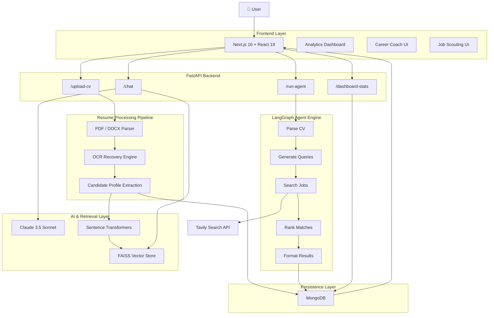

# JobScout AI

AI-powered job discovery platform that combines autonomous job scouting,
resume intelligence, semantic search, and personalized career coaching.

---

## Key Features

- Resume Parsing (PDF & DOCX)
- OCR Recovery for Scanned Documents
- Autonomous LangGraph Job Search Agent
- Real-Time Job Discovery with Tavily
- Multi-Criteria Job Ranking
- FAISS Vector Search
- RAG-Powered Career Coach
- Interactive Analytics Dashboard
- MongoDB Persistence Layer

---

## Architecture

[Mermaid Diagram]
## 🏗️ System Architecture

---

## Core Workflow

1. Upload Resume
2. Extract Candidate Profile
3. Generate Search Queries
4. Discover Live Job Opportunities
5. Rank Opportunities
6. Save Matches As per defined filter 
7. Chat with Career Coach

---

## Technology Stack

### Backend
- FastAPI
- LangGraph
- LangChain
- MongoDB
- FAISS
- SentenceTransformers
- Anthropic Claude
- Tavily Search

### Frontend
- Next.js
- React
- TypeScript
- Tailwind CSS
- Recharts

---

## 📡 API Overview

JobScout AI exposes a RESTful API for resume processing, autonomous job discovery, career coaching, analytics, and job management. The backend validates all requests using Pydantic models and provides structured JSON responses. Core endpoints include CV upload and indexing (`/upload-cv`), agent-driven job search (`/run-agent`), RAG-powered career coaching (`/chat`), dashboard analytics (`/dashboard-stats`), saved job management (`/save-job`, `/saved-jobs/{cv_id}`, `/delete-job`), and system monitoring (`/health`). Interactive API documentation is available through FastAPI Swagger UI at `http://localhost:8000/docs`.

---

## Installation

## ⚙️ Installation

Set up the backend by creating a Python virtual environment, installing the required dependencies from `requirements.txt`, and configuring the necessary environment variables for Anthropic, Tavily, and MongoDB. Start the FastAPI server to launch the API services. Next, navigate to the frontend directory, install the Node.js dependencies, configure the frontend environment variables, and run the Next.js development server. Once both services are running, the application will be accessible locally with full support for resume analysis, autonomous job scouting, semantic search, and AI-powered career coaching.

---

## System Reliability

### OCR Fallback
When searchable text cannot be extracted from PDFs, OCR processing is automatically triggered.

### Model Fallback
If the primary Claude model is unavailable, the system switches to alternative supported models.

### Resume Parsing Recovery
Basic profile extraction remains available even when LLM processing is unavailable.

### Video Demo
To See REal Timw Woorking Visit the LInk Given in the main Readme.md file
Team Members

