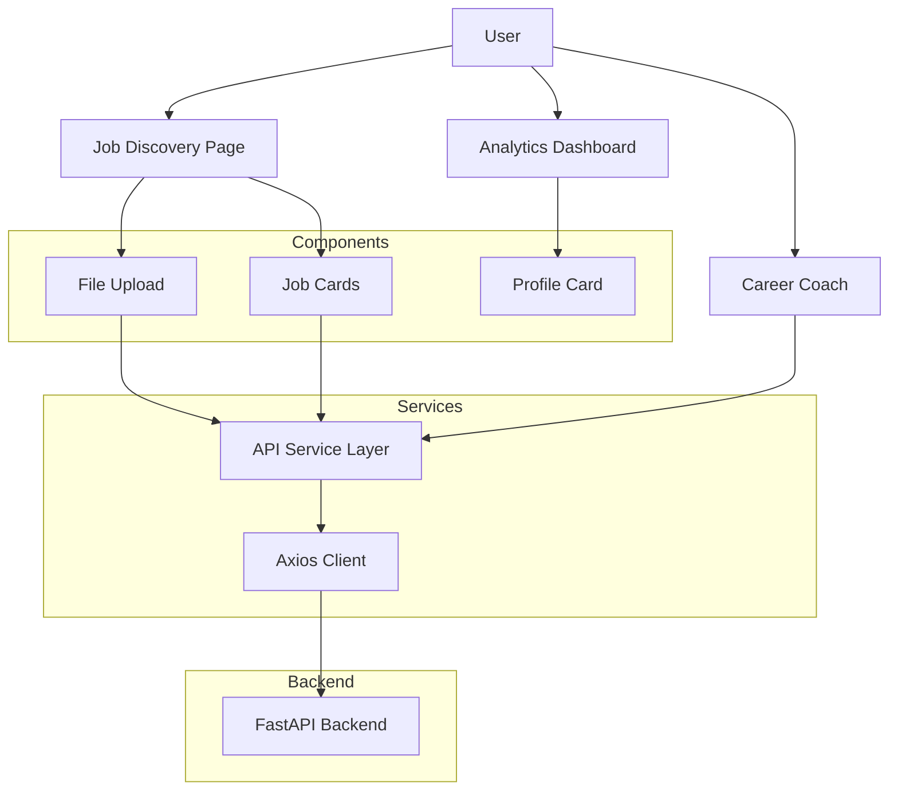

## 💻 Frontend Architecture

The JobScout AI frontend is built with **Next.js 16**, **React 19**, **TypeScript**, and **Tailwind CSS v4**, providing a responsive interface for resume analysis, job discovery, career coaching, and analytics visualization. The client communicates with the FastAPI backend through a centralized API service layer and presents real-time job recommendations, candidate insights, and AI-generated career guidance through a modern dashboard experience.

### Key Features

* Resume upload and validation
* Real-time job discovery interface
* Interactive job recommendation cards
* AI Career Coach chat experience
* Analytics dashboard with profile metrics
* Saved jobs management
* Responsive design across devices

### Frontend Architecture



### Project Structure

```text
src/
├── app/                # Application routes and pages
├── components/         # Reusable UI components
├── services/           # API communication layer
├── lib/                # Shared utilities and helpers
├── types/              # TypeScript interfaces and types
```

### Core Components

| Component         | Responsibility                             |
| ----------------- | ------------------------------------------ |
| `FileUpload.tsx`  | Resume upload and validation               |
| `JobCard.tsx`     | Display job recommendations and saved jobs |
| `ProfileCard.tsx` | Render candidate profile information       |
| `AuthGuard.tsx`   | Route and session protection               |
| `api.ts`          | Centralized backend communication layer    |

### Frontend Stack

* Next.js 16 (App Router)
* React 19
* TypeScript
* Tailwind CSS v4
* Framer Motion
* Recharts
* Axios
* Sonner

### Local Development

Create a `.env.local` file:

```env
NEXT_PUBLIC_API_URL=http://localhost:8000
```

Install dependencies and start the development server:

```bash
npm install
npm run dev
```

The application will be available at:

```text
http://localhost:3000
```
